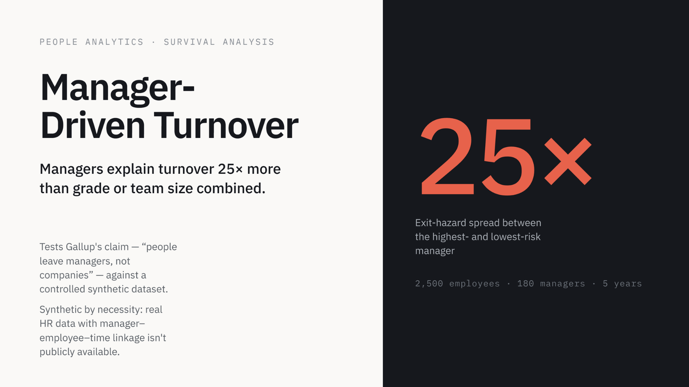
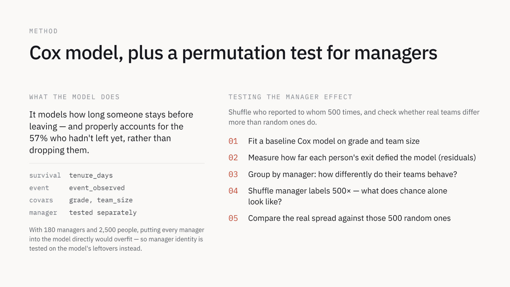
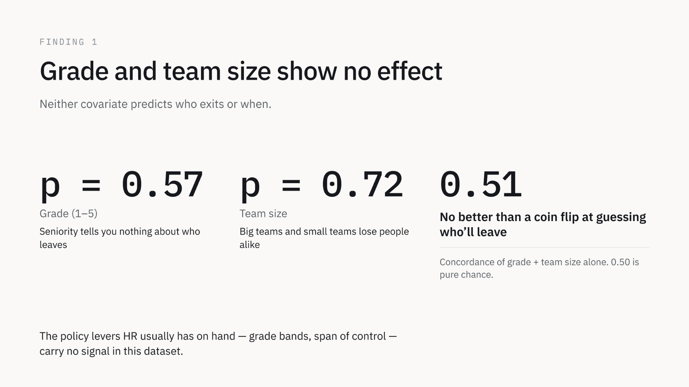
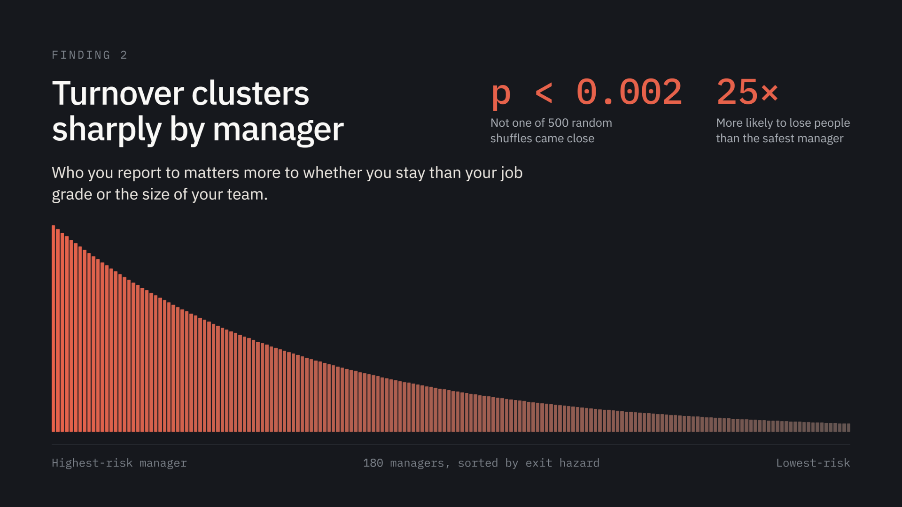
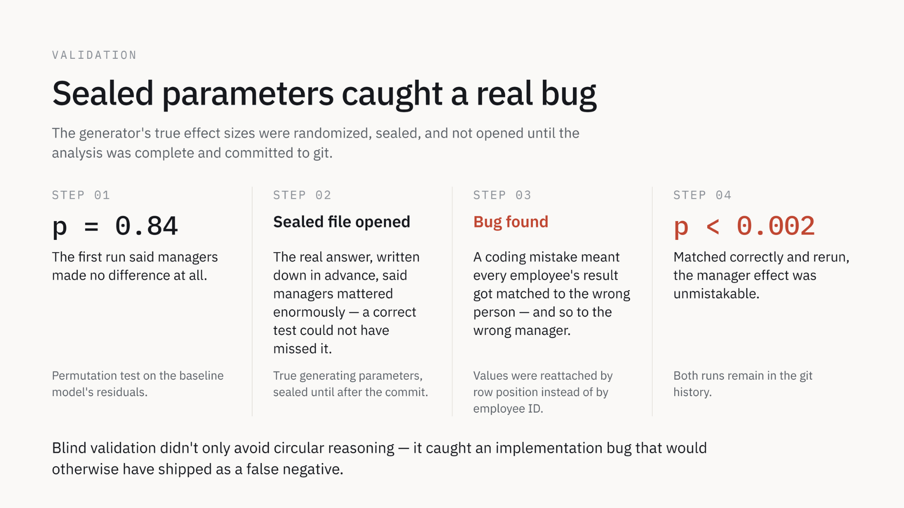
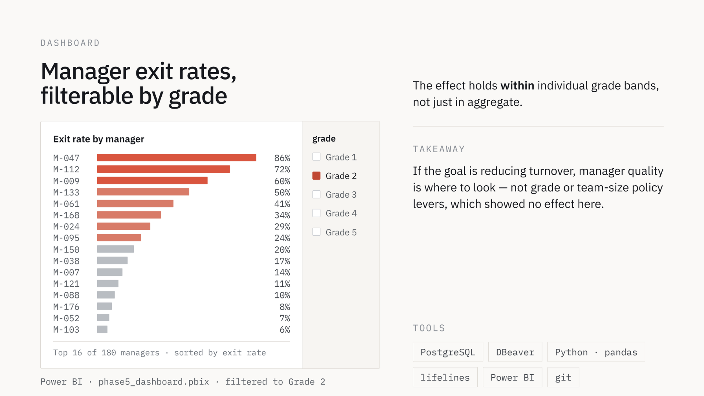

# Manager-Driven Turnover: Does Turnover Cluster by Manager?

A survival analysis of 2,500 employees under 180 managers, testing a
well-known claim in HR research (Gallup: "people don't leave companies,
they leave managers") against a controlled dataset, rather than taking
it at face value.

Synthetic data · Cox proportional hazards / survival analysis · PostgreSQL, Python, Power BI · Personal portfolio project

## Business problem

When turnover rises, HR usually reaches for the policy levers it already
has on hand: grade bands and span of control. The Gallup claim says
those levers miss the point — that who someone reports to matters more
to whether they stay than their grade or the size of their team. If
turnover really clusters by manager, retention effort belongs with
manager quality; if it doesn't, the effort is aimed at the wrong place.
Full framing in
[`01_business_problem/problem_statement.md`](01_business_problem/problem_statement.md).

## The question

> Does turnover cluster by manager, and does that clustering survive
> controlling for grade and team size?

Tenure itself isn't treated as a separate variable — it's the survival
clock. Using time-since-hire as the modeling basis (rather than a raw
turnover-rate comparison) automatically accounts for managers who happen to
have disproportionately many new hires, which is the standard confound in
naive manager-turnover comparisons.

## Data

Synthetic, not scraped. Real HR data with the granularity this question
needs — manager-employee linkage over time, with exit dates — essentially
never gets published; the handful of public HR datasets that exist (IBM HR
Attrition and its mirrors) are themselves fictional, cross-sectional, and
have no manager-to-employee time-series structure. A public-data check was
run and came up empty before defaulting to synthetic.

- 2,500 employees, 180 managers (avg span of control ~14)
- Staggered hire dates over a 5-year observation window
- Grade (1–5), team size, and manager identity built in as independently
  randomized candidate drivers of exit risk, plus irreducible noise
- 43% observed exit rate, 57% right-censored (still employed at cutoff)

Generator: [`02_data/generate_synthetic_data.py`](02_data/generate_synthetic_data.py).
Column definitions: [`02_data/data_dictionary.md`](02_data/data_dictionary.md).

## Method

Cox proportional hazards regression (`lifelines`), fit on `tenure_days` /
`event_observed`, with `grade` and `team_size` as covariates. Manager
clustering was tested separately via a residual-based permutation test
(180 managers is too many to dummy-encode without overfitting 2,500
observations):

1. Fit a baseline Cox model on grade and team_size only
2. Compute martingale residuals per employee
3. Aggregate residuals by manager, measure the variance across managers
4. Permute manager labels 500 times to build a null distribution of that
   variance
5. Compare the real observed variance against the null distribution

The full analysis is in
[`03_analysis/phase3_cox_analysis.ipynb`](03_analysis/phase3_cox_analysis.ipynb).

## Findings

Turnover clusters dramatically by manager. Employees under the highest-risk
managers in this dataset left at roughly **25x the rate** of employees under
the lowest-risk managers — a gap that survives controlling for grade and
team size, both of which turned out to have no meaningful effect on their
own.

| | Result |
|---|---|
| Grade | No significant effect (p = 0.57) |
| Team size | No significant effect (p = 0.72) |
| Model fit (grade + team_size alone) | Concordance 0.51 — no better than chance |
| Manager clustering | Highly significant (p ≈ 0) |
| Manager effect size | ~25x hazard ratio spread, highest- vs. lowest-risk manager |

Grade and team size, on their own, tell you almost nothing about who
leaves and when. Manager identity tells you a great deal.

## Validation methodology

The dataset was generated with hidden, randomized parameters (a manager
effect, a grade effect, a team-size effect, all independently sized) sealed
in a file that wasn't opened until after the analysis was complete and
committed to git. This avoids the obvious failure mode of synthetic-data
projects: building in an effect and then "discovering" the thing you built.

This caught a real bug. The first pass of the manager-clustering test
returned no signal (p = 0.84) — `lifelines.compute_residuals()` reorders
its output rows internally, and the original code re-attached residuals to
employees by position (`.values`) rather than by index, silently scrambling
every residual to the wrong employee. Opening the sealed answer key
revealed a manager effect too large to plausibly have been missed by a
correctly-implemented test, which is what surfaced the bug. Fixing the
index alignment and rerunning produced the p ≈ 0 result reported above.

The git history preserves both runs — the initial null result, the bug fix,
and the corrected result — as the record of this process.

## Dashboard

[`04_powerbi/phase5_dashboard.pbix`](04_powerbi/phase5_dashboard.pbix)
(Power BI) — manager-level exit-rate bar chart, sortable and filterable
by grade, showing the effect holds within grade bands individually, not
just in aggregate.

## Repo structure

- `01_business_problem/` — the business framing and the question
- `02_data/` — synthetic data generator, column definitions, and the
  generated dataset (`employees.csv`, `managers.csv`)
- `03_analysis/` — notebook with the Cox model and the manager
  clustering test
- `04_powerbi/` — Power BI dashboard source file
- `05_executive_brief/` — the deck (PowerPoint + individual slide
  images)

## Tools

PostgreSQL, DBeaver, Python (`pandas`, `lifelines`), Power BI, git.

## Limitations

- Grade, team size, and manager are modeled as independent drivers; a real
  organization's confounds are usually correlated (e.g. inexperienced
  managers concentrated in lower grades), which this dataset deliberately
  doesn't simulate
- The permutation test flags *that* clustering exists, not which managers
  are meaningfully different from which others — a follow-up would rank
  individual managers against a proper multiple-comparisons correction
  rather than eyeballing the dashboard's sorted bars

---

Full deck:
[`Manager-clustering_hazard_analysis.pptx`](05_executive_brief/Manager-clustering_hazard_analysis.pptx)
